<!-- ══════════════════════════════════════════════════════════════════
     HEADER
══════════════════════════════════════════════════════════════════ -->

  

  

  
  

  &nbsp;
  &nbsp;
  &nbsp;
  

 

<!-- ══════════════════════════════════════════════════════════════════
     DIVIDER
══════════════════════════════════════════════════════════════════ -->

  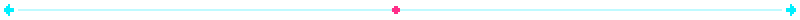

<!-- ══════════════════════════════════════════════════════════════════
     ABOUT  //  SYSTEM CAPABILITIES
══════════════════════════════════════════════════════════════════ -->

  

 

  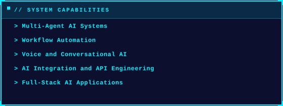

 

<!-- ══════════════════════════════════════════════════════════════════
     DIVIDER
══════════════════════════════════════════════════════════════════ -->

  

<!-- ══════════════════════════════════════════════════════════════════
     MISSION CONTROL  //  TECH STACK DASHBOARD
══════════════════════════════════════════════════════════════════ -->

  

&nbsp;// 53 custom pixel-chip badges — real logos, official brand colors, zero shields.io &nbsp;

  

<table width="100%" border="0" cellspacing="8" cellpadding="0">
  <tr>
    <td width="50%" align="center">
      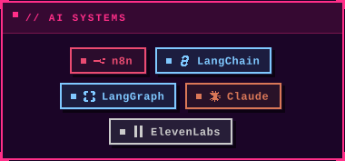
    </td>
    <td width="50%" align="center">
      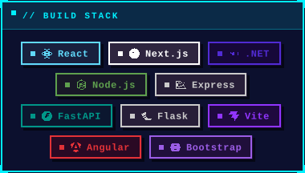
    </td>
  </tr>
  <tr>
    <td width="50%" align="center">
      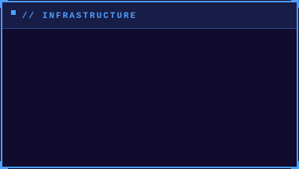
    </td>
    <td width="50%" align="center">
      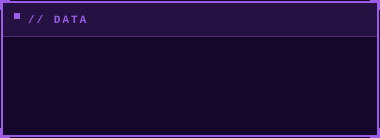
    </td>
  </tr>
  <tr>
    <td width="50%" align="center">
      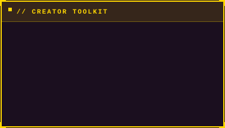
    </td>
    <td width="50%" align="center">
      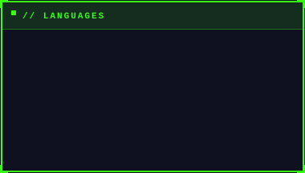
    </td>
  </tr>
</table>

 

<!-- ══════════════════════════════════════════════════════════════════
     DIVIDER
══════════════════════════════════════════════════════════════════ -->

  

<!-- ══════════════════════════════════════════════════════════════════
     CONTRIBUTION ACTIVITY
══════════════════════════════════════════════════════════════════ -->

  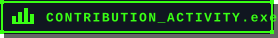

 

  

 

<!-- ──────────────────────────────── Metrics: Activity  ─────────────── -->

  

 

<!-- ══════════════════════════════════════════════════════════════════
     DIVIDER
══════════════════════════════════════════════════════════════════ -->

  

<!-- ══════════════════════════════════════════════════════════════════
     PERFORMANCE ANALYTICS
══════════════════════════════════════════════════════════════════ -->

  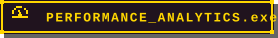

 

<!-- GitHub Stats Table (rate-limit-safe, custom Vercel endpoints) -->
<table width="100%">
  <tr>
    <td width="50%">
      <h3 align="center"><strong>Gɪᴛʜᴜʙ Sᴛᴀᴛs</strong></h3>
      

        
      

    </td>
    <td width="50%">
      <h3 align="center"><strong>Sᴛʀᴇᴀᴋ Sᴛᴀᴛs</strong></h3>
      

        
      

    </td>
  </tr>
  <tr>
    <td width="50%">
      <h3 align="center"><strong>Tᴏᴘ Lᴀɴɢᴜᴀɢᴇs</strong></h3>
      

        
      

    </td>
    <td width="50%">
      <h3 align="center"><strong>Tᴏᴘ Cᴏɴᴛʀɪʙᴜᴛɪᴏɴs</strong></h3>
      

        
      

    </td>
  </tr>
</table>

 

<!-- GitHub Trophies -->

  

 

<!-- Metrics: Languages (most-used + recently-used) -->

  
  

 

<!-- Metrics: Discussions/Reactions -->

  

 

<!-- ══════════════════════════════════════════════════════════════════
     DIVIDER
══════════════════════════════════════════════════════════════════ -->

  

<!-- ══════════════════════════════════════════════════════════════════
     FOOTER
══════════════════════════════════════════════════════════════════ -->

  

<!-- Quote image — place the downloaded GIF/PNG as: assets/decorations/never-said-code-one-day.png -->

  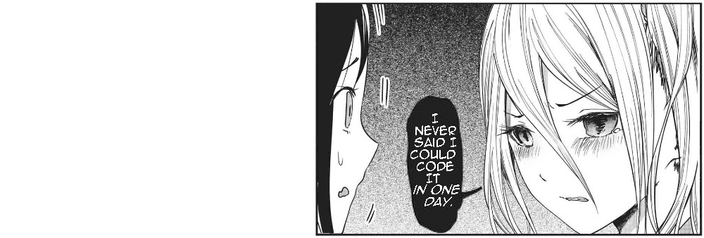

