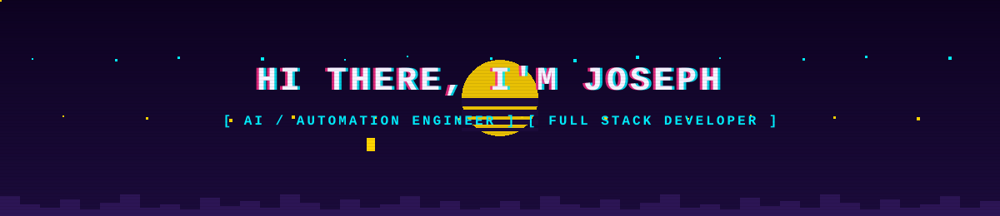
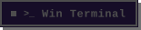

  

  

  
  

  &nbsp;
  &nbsp;
  &nbsp;
  

 

<pre>
&gt; 
&gt; 
&gt; 
&gt; 
&gt; AI/Automation Engineer @ Jenesys Tech 
</pre>

 

&nbsp;// 53 custom pixel-chip badges — real logos, official brand colors, zero shields.io &nbsp;

**LANGUAGES**

         

**FRAMEWORKS & FRONTEND**

       

**BACKEND & APIs**

    

**AI & AUTOMATION**

    

**DATABASES**

   

**CLOUD & DEVOPS**

        

**TOOLS & DESIGN**

           

 

## 🐍 Contribution Snake

  

 

  

⚠️ If a card above shows "Failed to retrieve" — that's the shared Vercel deployment hitting GitHub's public API rate limit, not your account. It clears on refresh.

 

  

